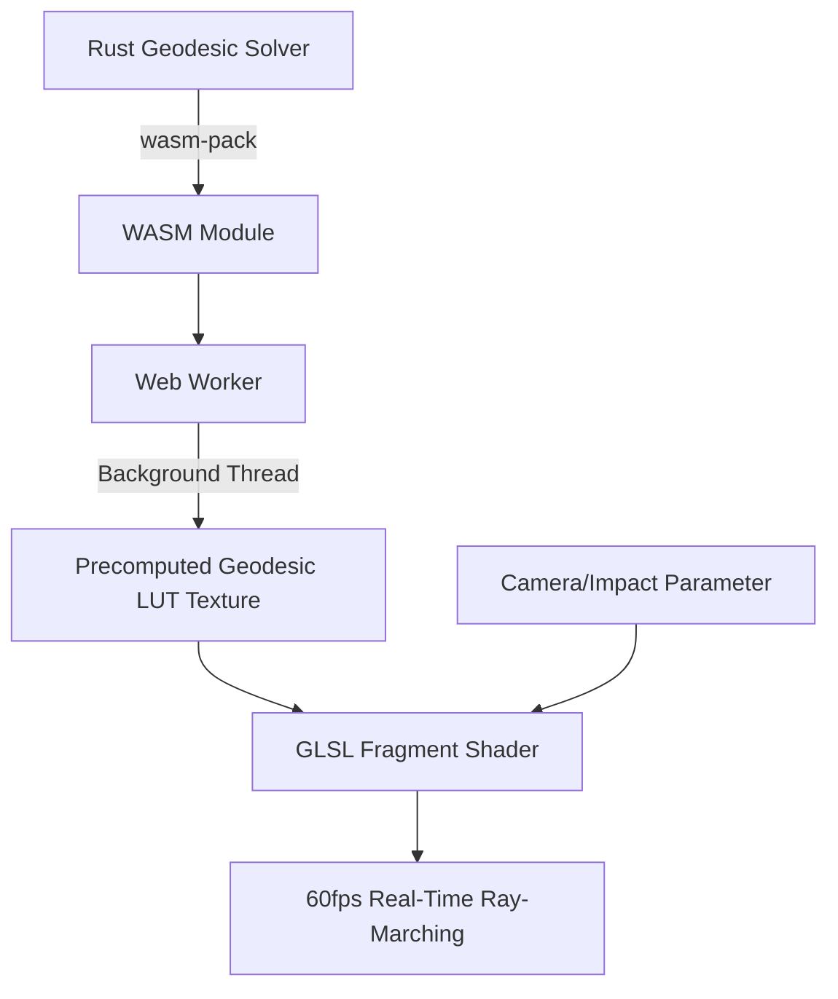

<!-- BEGIN:nextjs-agent-rules -->
# This is NOT the Next.js you know

This version has breaking changes — APIs, conventions, and file structure may all differ from your training data. Read the relevant guide in `node_modules/next/dist/docs/` before writing any code. Heed deprecation notices.
<!-- END:nextjs-agent-rules -->

# Event Horizon 🕳️ - AI Agent Codex & Architecture Guidelines

Welcome, AI Agent! This document outlines the project architecture, directory structure, conventions, build workflows, and constraints of the **Event Horizon** repository to help you deliver highly optimized, correct, and premium code.

---

## 🏗️ Technical Architecture & Hybrid Pipeline

Event Horizon is an immersive, physically-based WebGL ray-marching simulation of a Schwarzschild black hole. To achieve 60fps in the browser, it uses a **Hybrid WASM + WebGL Pipeline**:



1. **Rust / WASM (Offline / Initialization):**
   - Calculates geodesic paths of photons under General Relativity using **Runge-Kutta 4th Order (RK4)** integration.
   - Generates a **256x256 RGBA Float32Array Lookup Table (LUT)** DataTexture.
2. **Web Worker (Concurrency):**
   - Executes the WASM calculations in a background Web Worker to keep the browser main UI thread 100% responsive.
3. **GLSL Fragment Shader (Real-Time rendering):**
   - Instead of running 1500-step integrations on the GPU, the fragment shader performs a quick `texture2D()` lookup of the precomputed LUT, transforming a heavy math equation into a fast texture sample (yielding a 50x-100x speedup).
   - If the WASM calculation is in progress, the shader gracefully falls back to a low-fidelity, real-time ray-marching loop.

---

## 📂 Repository Structure & Key Directories

- `rust/geodesic-lut/`: The Rust crate containing the geodesic equations and RK4 solvers.
  - `src/lib.rs`: Entry point containing the WASM bindings (`wasm-bindgen`).
- `public/wasm/`: The compiled WASM module output (produced by `wasm-pack`). Do not edit files here directly.
- `src/app/`: Next.js (App Router) pages, layouts, and global styles.
  - `favicon.ico`: High-quality 48x48 icon cropped from `black_hole.png`.
- `src/components/`: React Three Fiber and UI components.
- `src/shaders/`: GLSL shaders for WebGL ray-marching and post-processing.
- `src/workers/`: Web Worker files responsible for spawning the WASM geodesic solver.

---

## ⚙️ Environment & Compilation Workflows

We use **Docker & Docker Compose** for streamlined, multi-stage development and production environments.

### 🐳 Docker Configuration (Multi-Stage)
The `Dockerfile` is split into several crucial stages to optimize build speed and image size:
1. `wasm-builder` (Rust): Compiles the Rust geodesic solver into WASM.
2. `base` (Node): Shared node dependencies installed via `npm ci`.
3. `development` (Node): Dev target with **Hot Reload** enabled.
4. `builder` (Node): Compiles the Next.js production build (`npx next build`).
5. `runner` (Node): Lightweight production image with a secure non-root `nextjs` user.

### 💻 Developer Workflow Command Reference

#### 1. Local Development (Docker-based - Recommended)
To run the server locally with **Hot Reload (Fast Refresh)**:
```bash
docker compose up -d --build
```
- **Hot Reload Integration**: The project code is synchronized via volume mounting (`.:/app`).
- **File System Watching**: Enabled via `WATCHPACK_POLLING=true` in `docker-compose.yml` to guarantee immediate updates on Windows (WSL) and macOS hosts.
- Anonymous volumes protect `/app/node_modules`, `/app/.next`, and `/app/rust/geodesic-lut/target` from clashing with host-compiled folders.

#### 2. Manual Local Development (Bare-metal)
If running without Docker, the Rust toolchain with `wasm-pack` is required:
```bash
# Build WASM
npm run build:wasm
# Start dev server
npm run dev
```

---

## 📜 Coding Conventions & Guidelines for AI Agents

### 1. WebGL & Three.js Resource Management
- **Memory Disposal**: Always dispose of Three.js objects (materials, geometries, textures, and render targets) in `useEffect` cleanup return functions to prevent browser tab crashes and memory leaks:
  ```javascript
  return () => {
    material.dispose();
    geometry.dispose();
    texture.dispose();
  };
  ```
- **GLSL Shaders**: Handle GLSL shaders in React Three Fiber by referencing custom shaders in `/src/shaders/`. Note that `next.config.ts` uses raw-loader for `.glsl`, `.vert`, and `.frag` extensions.

### 2. Next.js & React Rules
- Follow Next.js App Router rules strictly.
- Always use `"use client"` directive for components utilizing React Three Fiber, Framer Motion, hooks, or browser-only APIs.
- Keep components small, modular, and focused.

### 3. Open Source Standards
- The project is licensed under the **MIT License** (stored in `LICENSE`). Respect all attribution requirements.
- Maintain all code comments, docstrings, and architectural descriptions in **professional English**.
- Do not check in build artifacts (such as local `.next/`, `node_modules/`, `rust/**/target/`, or local environments) into Git. Ensure they match `.dockerignore` and `.gitignore`.
