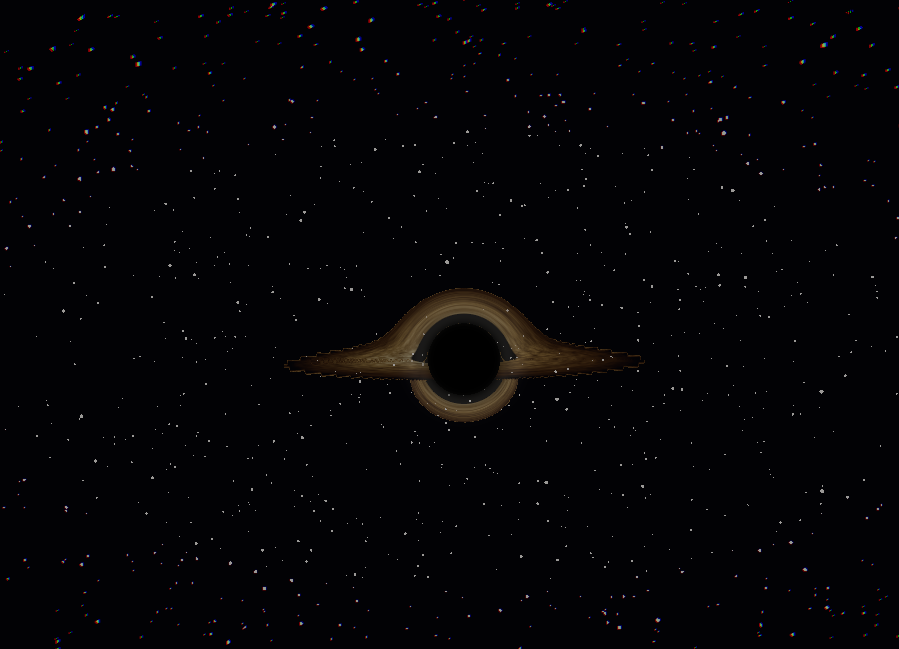

# Event Horizon 🕳️



An immersive, cinematic, physically-based WebGL experience exploring the gravitational anomalies of a black hole.

**Event Horizon** uses real physics (Schwarzschild metric) to simulate the bending of light around a massive gravitational body. By precomputing a massive Geodesic Lookup Table (LUT) using high-precision Runge-Kutta 4th order (RK4) integration via **Rust and WebAssembly (WASM)**, we achieve real-time ray-marching performance in the browser using **WebGL** and **React Three Fiber**.

---

## 🚀 Features

- **Physically-based Rendering**: Light rays are bent according to General Relativity, accurately simulating the gravitational lensing, the photon ring, and the event horizon.
- **WASM Geodesic Precomputation**: A high-performance Rust module calculates the ray paths and intersections offline. This heavy computation runs in a **Web Worker**, ensuring the UI remains 100% responsive.
- **Real-Time GLSL Shader**: The fragment shader uses the precomputed LUT as a texture, turning an expensive 1500-step RK4 integration per pixel into a single `texture2D()` read, providing a **50-100x performance boost**.
- **Cinematic Experience**: A smooth, 5-phase scrolling journey ("Nebula" to "Singularity"), featuring custom smooth-snap scrolling and an immersive auto-loop sequence upon entering the event horizon.
- **Adaptive Post-Processing**: Dynamic bloom and chromatic aberration that scale with the gravitational intensity of your proximity to the black hole.

---

## 🏗️ Architecture Stack

- **Framework**: [Next.js](https://nextjs.org/) (App Router)
- **3D Engine**: [Three.js](https://threejs.org/) & [React Three Fiber](https://docs.pmnd.rs/react-three-fiber/)
- **Shaders**: Vanilla GLSL
- **High-Performance Compute**: [Rust](https://www.rust-lang.org/) & [WebAssembly](https://webassembly.org/)
- **Concurrency**: Web Workers
- **Animations**: [Framer Motion](https://www.framer.com/motion/)

---

## ⚙️ How it Works

The biggest challenge in rendering a black hole in real-time is solving the geodesic equations for every single pixel on the screen. Doing an 80+ step RK4 integration per pixel in a fragment shader destroys GPU performance. 

Our solution is a **Hybrid Pipeline**:

1. **Rust / WASM (Offline/Initialization):**
   - We simulate a grid of photons originating from the camera.
   - We use RK4 integration with 1500 steps to trace their paths through the curved spacetime.
   - We record where each ray hits the accretion disk (radius and angle) and whether it gets captured by the event horizon.
   - We output this data as a `256x256 RGBA Float32Array` DataTexture.
2. **Web Worker (Concurrency):**
   - To prevent the browser from freezing during this heavy calculation (~4-10 seconds), the WASM is loaded and executed inside a background Web Worker.
3. **GLSL Fragment Shader (Real-Time Rendering):**
   - The shader projects the camera ray onto a 2D plane to find the corresponding "impact parameter".
   - It samples the WASM-generated LUT texture.
   - If the LUT says the ray hit the disk, the shader samples the accretion disk noise pattern at that specific angle/radius.
   - If the WASM hasn't finished calculating yet, the shader seamlessly falls back to a lower-fidelity, real-time RK4 integration loop to keep the scene active.

---

## 💻 Getting Started

### Prerequisites

You need [Node.js](https://nodejs.org/) installed, and the [Rust toolchain](https://rustup.rs/) (including `cargo`) with `wasm-pack` installed to compile the geodesic LUT module.

```bash
# Install wasm-pack
cargo install wasm-pack
```

### Installation

1. Clone the repository:
```bash
git clone <repository-url>
cd event-horizon
```

2. Install dependencies:
```bash
npm install
```

3. Start the development server:
```bash
npm run dev
```

*Note: The `dev` and `build` scripts automatically compile the Rust code to WASM and place it in the `public/wasm` directory via a `prebuild` hook.*

---

## 🎮 Navigation

The experience is driven entirely by scrolling.
1. **Phase 1 (Nebula)**: The vast emptiness of space.
2. **Phase 2 (Discovery)**: The first signs of gravitational lensing.
3. **Phase 3 (Approach)**: Time dilates as you approach the ISCO (Innermost Stable Circular Orbit).
4. **Phase 4 (Event Horizon)**: The point of no return. Intense chromatic aberration and gravity.
5. **Phase 5 (Singularity)**: You cross the threshold. The screen fades to black, and the universe resets.

---

## 📝 License

This project is open-source and available under the [MIT License](LICENSE). Feel free to use, modify, and distribute it!
