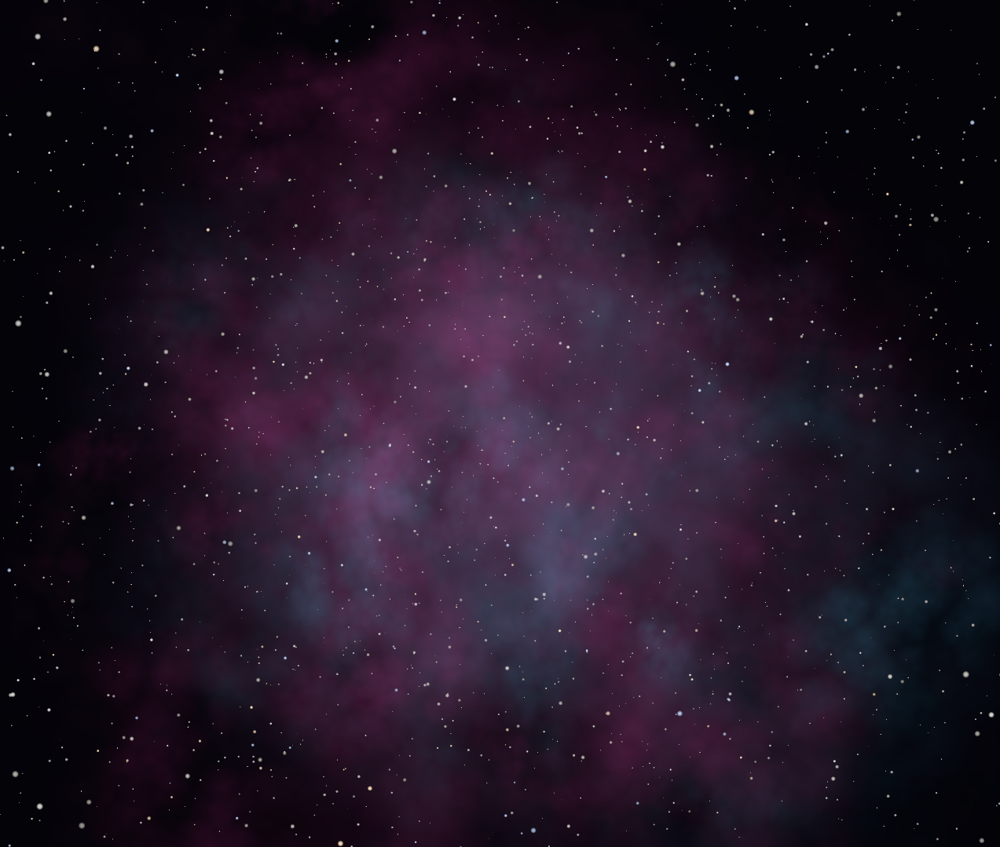
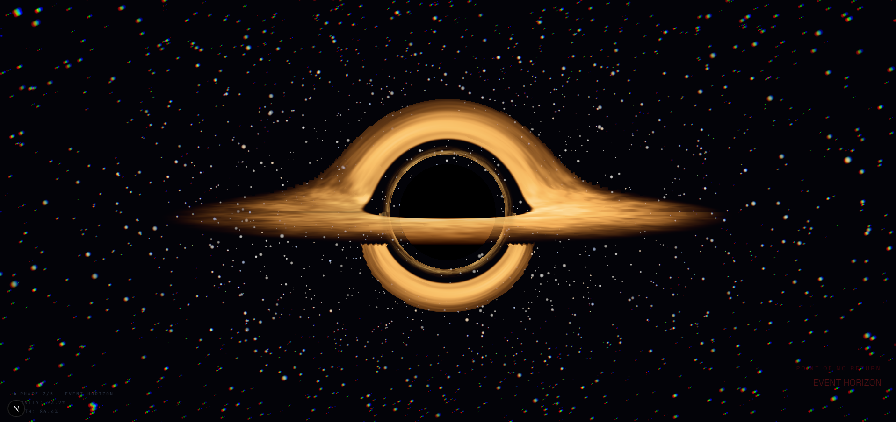

# Event Horizon 🕳️

<p align="center">
  
  
</p>

An immersive, cinematic, physically-based WebGL experience exploring the gravitational anomalies of a black hole.

**Event Horizon** uses real physics (Schwarzschild metric) to simulate the bending of light around a massive gravitational body. By precomputing a massive Geodesic Lookup Table (LUT) using high-precision Runge-Kutta 4th order (RK4) integration via **Rust and WebAssembly (WASM)**, we achieve real-time ray-marching performance in the browser using **WebGL** and **React Three Fiber**.

---

## 🚀 Features
                  

- **Physically-based Rendering**: Light rays are bent according to General Relativity, accurately simulating the gravitational lensing, the photon ring, and the event horizon.
- **Dynamic Hybrid Spatial Renderer**: Smoothly blends real-time, high-precision RK4 ray-marching at the horizon boundary (where LUT bilinear interpolation is mathematically corrupted) with ultra-fast LUT lookups for the outer disk, maintaining a locked 60 FPS.
- **Texture-Based Volumetric Nebula**: The introductory cosmic dust cloud utilizes heavily optimized instanced billboarding mapped with a pre-rendered smoke texture. We use procedural UV warping and a "Zero-Accumulation" fragment architecture to simulate thick, organic fluid turbulence while strictly preventing additive blending from crushing into solid walls of light.
- **Volumetric Gas Aesthetic**: Fluffy, dense accretion clouds driven by FBM noise with decoupled physical opacity, ensuring dimmed or redshifted gas correctly occludes stars and background layers.
- **Fiery Inner Corona**: A perspective-correct, `b`-based lensed inner ring of filamentary gas swirling around the event horizon, correctly depth-sorted behind the foreground disk.
- **WASM Geodesic Precomputation**: A high-performance Rust module calculates the ray paths and intersections offline. This heavy computation runs in a **Web Worker**, ensuring the UI remains 100% responsive.
- **Cinematic Experience**: A smooth, 5-phase scrolling journey ("Nebula" to "Singularity"), featuring custom smooth-snap scrolling and an immersive auto-loop sequence upon entering the event horizon.
- **Adaptive Post-Processing**: Dynamic bloom and chromatic aberration that scale with the gravitational intensity of your proximity to the black hole.

---

## 🏗️ Architecture Stack

- **Framework**: [Next.js](https://nextjs.org/) (App Router)
- **3D Engine**: [Three.js](https://threejs.org/) & [React Three Fiber](https://docs.pmnd.rs/react-three-fiber/)
- **Shaders**: Vanilla GLSL
- **High-Performance Compute**: [Rust](https://www.rust-lang.org/) & [WebAssembly](https://webassembly.org/)
- **Concurrency**: Web Workers
- **Animations**: [Framer Motion](https://www.framer.com/motion/)

---

## ⚙️ How it Works

The biggest challenge in rendering a black hole in real-time is solving the geodesic equations for every single pixel on the screen. Doing an 80+ step RK4 integration per pixel in a fragment shader destroys GPU performance. 

Our solution is a **Hybrid Pipeline**:

1. **Rust / WASM (Offline/Initialization):**
   - We simulate a grid of photons originating from the camera.
   - We use RK4 integration with 1500 steps to trace their paths through the curved spacetime.
   - We record the exact equatorial plane crossings (cosine/sine of the angle, radius, and Signed Distance Field to the disk boundaries).
   - We output this data as a raw `256x256 RGBA Float32Array` buffer, which the main thread converts to half-floats (`Uint16Array` / `RGBA16F`) to enable high-performance, native WebGL 2 linear filtering on all GPU drivers.
2. **Web Worker (Concurrency):**
   - To prevent the browser from freezing during this heavy calculation (~2-5 seconds), the WASM is loaded and executed inside a background Web Worker.
3. **GLSL Fragment Shader (Real-Time Hybrid Spatial Engine):**
   - The shader projects the camera ray onto the accretion disk's plane to find the perspective-correct "impact parameter" (b) and camera angle (theta).
   - **Dynamic Spatial Routing**: To eradicate "gray halo" artifacts caused by WebGL bilinear interpolation across the horizon's infinite mathematical discontinuity, the shader uses a spatial hybrid model. 
   - For the core region (`b < 2.8`), it executes a mathematically flawless, hardware-optimized real-time RK4 integration loop.
   - For the distant background disk (`b > 3.2`), it samples the WASM-generated LUT texture using smooth bilinear filtering.
   - A smooth transition zone (`b ∈ [2.8, 3.2]`) blends the two pipelines seamlessly, completely eliminating visual seams while maintaining a locked 60 FPS performance.
   - It splits the accretion disk into front and back layers using the lensed coordinates, compositing the front layer on top of the event horizon silhouette via standard alpha-over for a realistic Gargantua appearance.
   - If the Web Worker hasn't finished calculating the LUT yet during initialization, the shader gracefully falls back to the full real-time RK4 integration loop across the entire screen.

---

## 💻 Getting Started

You can choose to run the project using **Docker** (recommended as it packages all Node, Rust, and WebAssembly dependencies automatically) or perform a **manual local installation**.

### 🐳 Option 1: Running with Docker (Recommended)

This is the easiest way to run the project without needing to install Node.js, Rust, or the WASM build toolchain on your host machine.

1. **Clone the repository:**
   ```bash
   git clone <repository-url>
   cd event-horizon
   ```

2. **Build and start the container:**
   ```bash
   docker compose up --build
   ```

3. Open [http://localhost:3000](http://localhost:3000) in your browser to experience the event horizon!

---

### 💻 Option 2: Manual Local Installation

#### Prerequisites

You need [Node.js](https://nodejs.org/) installed, and the [Rust toolchain](https://rustup.rs/) (including `cargo`) with `wasm-pack` installed to compile the geodesic LUT module.

```bash
# Install wasm-pack
cargo install wasm-pack
```

#### Installation

1. **Clone the repository:**
   ```bash
   git clone <repository-url>
   cd event-horizon
   ```

2. **Install dependencies:**
   ```bash
   npm install
   ```

3. **Compile the Geodesic LUT WASM module:**
   ```bash
   npm run build:wasm
   ```

4. **Start the development server:**
   ```bash
   npm run dev
   ```

*Note: The `npm run build:wasm` command compiles the Rust code using `wasm-pack` and outputs it to `public/wasm`. It also runs automatically before building for production via the `prebuild` hook.*

---

## 🎮 Navigation

The experience is driven entirely by scrolling.
1. **Phase 1 (Nebula)**: The vast emptiness of space.
2. **Phase 2 (Discovery)**: The first signs of gravitational lensing.
3. **Phase 3 (Approach)**: Time dilates as you approach the ISCO (Innermost Stable Circular Orbit).
4. **Phase 4 (Event Horizon)**: The point of no return. Intense chromatic aberration and gravity.
5. **Phase 5 (Singularity)**: You cross the threshold. The screen fades to black, and the universe resets.

---

## 📝 License

This project is open-source and available under the [MIT License](LICENSE). Feel free to use, modify, and distribute it!
