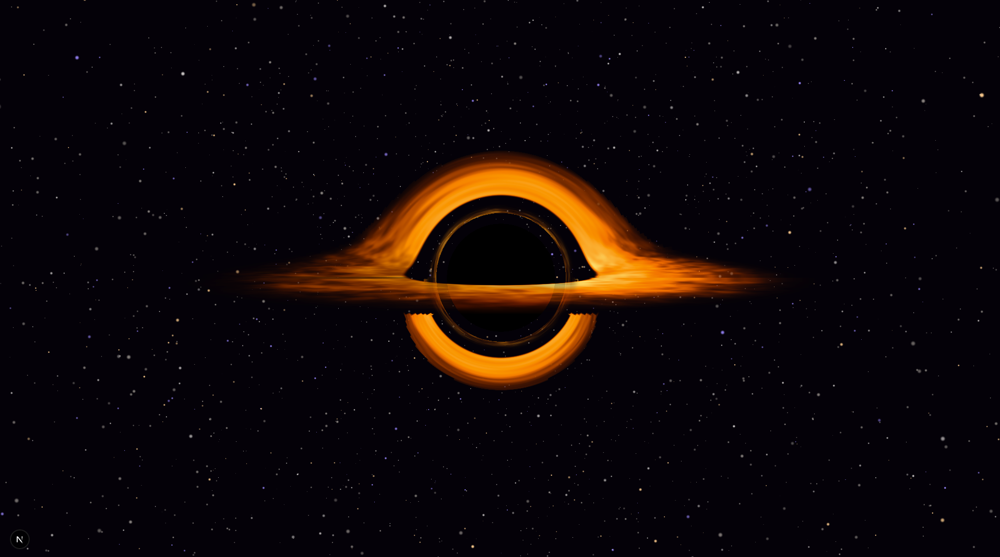
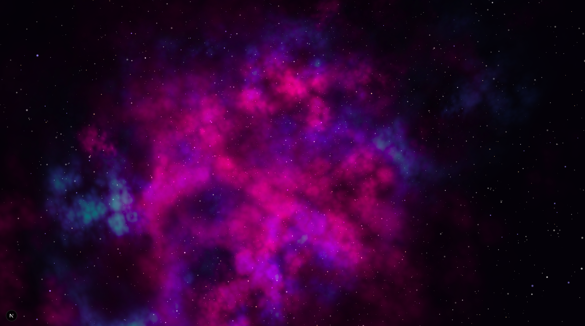

# Event Horizon 🕳️

<p align="center">
  
  
</p>

An immersive, cinematic, physically-based WebGL experience exploring the gravitational anomalies of a black hole.

**Event Horizon** uses real physics (Schwarzschild metric) to simulate the bending of light around a massive gravitational body. A high-precision **Runge-Kutta 4th order (RK4)** geodesic integrator runs entirely in a GLSL fragment shader, achieving real-time ray-marching performance in the browser using **WebGL** and **React Three Fiber**.

---

## 🚀 Features
                  
- **Physically-based Rendering**: Light rays are bent according to General Relativity, accurately simulating the gravitational lensing, the photon ring, and the event horizon.
- **Layered FBO Architecture**: In order to achieve a locked 60 FPS on integrated GPUs, the black hole raymarching occurs in an off-screen render target at a fractional resolution. A secondary pass bilinearly composites the accretion disk over the native-resolution background, decoupling raymarch mathematics from screen pixels.
- **Pure RK4 Geodesic Engine**: Every pixel fires a ray through curved Schwarzschild spacetime using a hardware-optimized RK4 integrator. A vacuum-skip optimization analytically jumps rays past empty space into the gravity zone, making full-screen integration affordable even on integrated GPUs.
- **Orbital Cinematic Camera**: As the user approaches the Event Horizon, the camera leaves its linear rail and begins a 3D orbital spiral around the black hole, with flawless 360-degree gravitational lensing from any angle.
- **Volumetric Gas Aesthetic**: Fluffy, dense accretion clouds driven by FBM noise with decoupled physical opacity, ensuring dimmed or redshifted gas correctly occludes stars and background layers without double-alpha darkening.
- **Fiery Inner Corona**: A perspective-correct, `b`-based lensed inner ring of filamentary gas swirling around the event horizon, correctly depth-sorted behind the foreground disk.
- **Texture-Based Volumetric Nebula**: The introductory cosmic dust cloud utilizes heavily optimized instanced billboarding mapped with a pre-rendered smoke texture and a "Zero-Accumulation" fragment architecture.
- **Geometry-Anchored Timeline**: The cinematic camera pacing and phase transitions are dynamically driven by physical world anchors (such as the accretion disk radius), ensuring the visual experience scales perfectly with geometry changes.
- **Diegetic Helmet HUD (Unit-7 Protocol)**: An immersive, physical-feeling visor overlay displaying real-time telemetry, DATA_LINK upload progress, and dual time-dilation clocks (Local Probe Time vs. Earth Year) that react dynamically to the gravitational forces of the approaching singularity.
- **Gravitational Star Lensing**: Background celestial bodies and starfields are accurately warped and bent by the black hole's mass according to the Schwarzschild metric.

---

## 🏗️ Architecture Stack

- **Framework**: [Next.js](https://nextjs.org/) (App Router)
- **3D Engine**: [Three.js](https://threejs.org/) & [React Three Fiber](https://docs.pmnd.rs/react-three-fiber/)
- **Shaders**: Vanilla GLSL
- **State Management**: [Zustand](https://github.com/pmndrs/zustand)
- **Animations**: [Framer Motion](https://www.framer.com/motion/)

---

## ⚙️ How it Works

The biggest challenge in rendering a black hole in real-time is solving the geodesic equations for every single pixel on the screen.

Our solution is a **Layered FBO + RK4 Pipeline**:

1. **GLSL Fragment Shader (Off-screen Raymarcher):**
   - The shader runs inside an FBO sized dynamically by the detected GPU profile (e.g., 35% resolution for integrated graphics).
   - Every pixel fires a ray through curved Schwarzschild spacetime using a mathematically flawless RK4 integrator.
   - A **vacuum-skip optimization** analytically jumps each ray past empty flat space directly to the gravity zone, spending all integration steps where curvature matters — achieving full-screen RK4 at 60 FPS even on integrated GPUs.
2. **Bilinear Composite Pass:**
   - A secondary full-screen quad samples the FBO with bilinear filtering, upscaling to native resolution. Because the accretion disk is gaseous, the upscale is visually imperceptible.
3. **Cinematic Progression**:
   - The scroll journey dictates the camera's Z-axis position.
   - Upon reaching the **Event Horizon**, `useOrbitCamera` takes control, driving the user in a spiral with full 360-degree gravitational lensing from any angle.

---

## 💻 Getting Started

You can choose to run the project using **Docker** (recommended) or perform a **manual local installation**.

### 🐳 Option 1: Running with Docker (Recommended)

This is the easiest way to run the project without needing to install Node.js on your host machine.

1. **Clone the repository:**
   ```bash
   git clone <repository-url>
   cd event-horizon
   ```

2. **Build and start the container:**
   ```bash
   docker compose up -d --build
   ```

3. Open [http://localhost:3000](http://localhost:3000) in your browser.

---

### 💻 Option 2: Manual Local Installation

#### Prerequisites

You need [Node.js](https://nodejs.org/) installed.

#### Installation

1. **Clone the repository:**
   ```bash
   git clone <repository-url>
   cd event-horizon
   ```

2. **Install dependencies:**
   ```bash
   npm install
   ```

3. **Start the development server:**
   ```bash
   npm run dev
   ```

---

### 🚀 Deployment

The project is designed to be easily deployed as a tagged release on **Vercel**. Since it is a Next.js App Router project without any heavy backend dependencies, it can be deployed directly via the Vercel dashboard by linking the GitHub repository.

---

## 🎮 Navigation

The experience is driven entirely by scrolling.
1. **Phase 1 (Nebula)**: The vast emptiness of space.
2. **Phase 2 (Revelation)**: The first signs of gravitational lensing.
3. **Phase 3 (Discovery)**: The black hole reveals its accretion disk.
4. **Phase 4 (Approach)**: Time dilates as you approach the ISCO.
5. **Phase 5 (Event Horizon)**: The point of no return. The camera leaves the rail and begins an orbital spiral.
6. **Phase 6 (Singularity)**: You cross the threshold. The screen fades to pitch black, freezing the simulation and triggering the final Epilogue transmission from Earth.

---

## 📝 License

This project is open-source and available under the [MIT License](LICENSE). Feel free to use, modify, and distribute it!